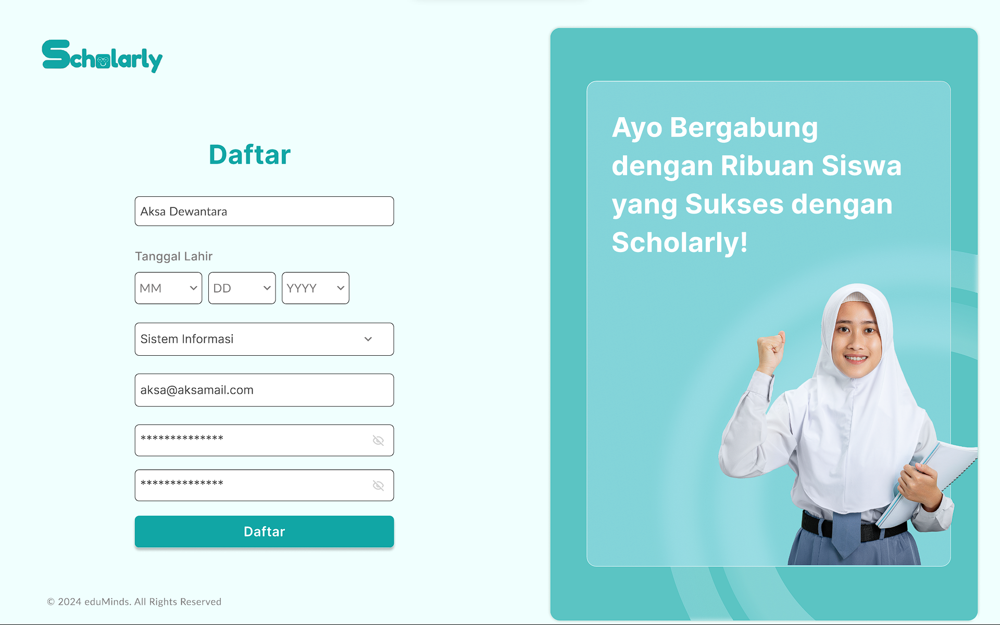

# Scholarly Application

Scholarly is an innovative application designed to help Indonesian students prepare for the UTBK (Ujian Tulis Berbasis Komputer). Our mission is to provide students with the tools and resources they need to succeed in their exams.




## Features (Developing in progress)

- **Comprehensive Study Materials:** Access a wide range of study materials tailored to the UTBK syllabus.
- **Practice Tests:** Take practice tests that mimic the actual exam conditions.
- **Performance Analytics:** Get detailed analytics on your performance to identify strengths and areas for improvement.
- **Interactive Learning:** Engage with interactive content and quizzes to enhance your learning experience.

## Technologies Used

- **HTML**: For structuring the web pages.
- **CSS**: For styling the application.
- **React (TypeScript)**: For building the user interface.
- **Next.js**: For server-side rendering and static site generation.

## Installation

To get started with the Scholarly application, follow these steps:

1. **Clone the repository:**
    ```bash
    git clone https://github.com/username/scholarly.git
    ```

2. **Navigate to the project directory:**
    ```bash
    cd scholarly
    ```

3. **Install the dependencies:**
    ```bash
    npm install
    ```

4. **Start the development server:**
    ```bash
    npm run dev
    ```

## Usage

Once the development server is running, open your web browser and go to `http://localhost:3000` to see the Scholarly application in action. You can start exploring the features and functionalities designed to help you prepare for the UTBK.

## Author

- **Shafa Najwa Nathania** - Software Engineering

## Credits

This project was made possible thanks to the contributions of:

- **Ellen, Lala** - Product Manager
- **Marsya, Elmi** - UI/UX Designer

## Thank you Sistech 2024! <3
